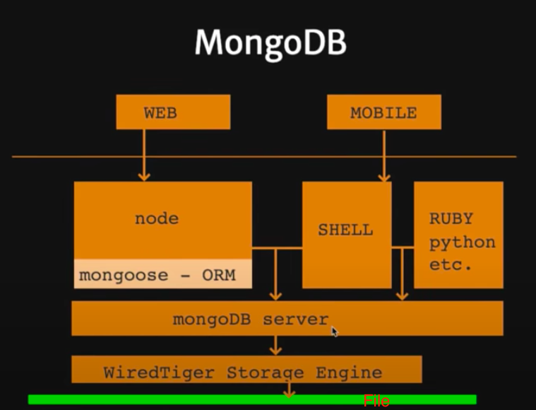

# How Mongodb works

- Here we don't have normalization like as in relational databases.
- In simple word there is no schema model.
- No Schema and collection of documents
- Mongodb focuses on collection of documents
- mongodb is amazing when we have havy read and write applications. read and write is very less in the cost as compare to other relational DBs
  
- In relational database we have multiple table and then pull data from multiple tables.
- But mongodb stores everything at one place simply store everything in one document, it might look big document but pulling data from that is very fast.
- If we want to add new field in the relational database then we need to change entire structure of the table. But in mongodb we can add or remove fields anytime without changing structure
- Mobile & Web: final abstraction for web and mobile(react, flutter, android, etc).
- Node and mongoose-ORM: node interects with mongodb server with mongoose-ORM(handles working with apis of mongodb server).
- SHELL: we can directly use or query mongodb server without using any language and orms. DataAdministrators uses this.
- WiredTiger Storage Engine: its a storage engine that mongodb uses
